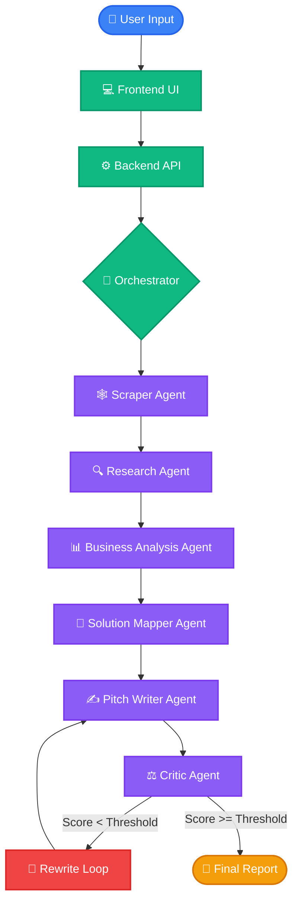

<div align="center">

# 🤖 Multi-Agent Sales Intelligence

[](https://reactjs.org/)
[](https://fastapi.tiangolo.com/)
[](https://ollama.com/)
[](https://ai.google.dev/)
[](https://nomic.ai/)
[](#)
[](https://ai.google/)
[](https://www.kaggle.com/)
[](https://opensource.org/licenses/MIT)

*An AI-powered multi-agent sales intelligence platform that autonomously researches companies, analyzes business opportunities, and generates personalized, high-converting outreach.*

</div>

---

## 🏆 Competition Information

> [!NOTE]
> **Built for:** Google × Kaggle | Vibe Coding Agents Capstone  
> **Category:** Agents for Business  

---

## 🎥 Live Demo

Watch the complete walkthrough here:

[](https://www.linkedin.com/posts/muhammad-awais-awais-451949392_ai-multiagent-generativeai-ugcPost-7479075931219771392-fFV0/)

[Watch the LinkedIn Demo Video](https://www.linkedin.com/posts/muhammad-awais-awais-451949392_ai-multiagent-generativeai-ugcPost-7479075931219771392-fFV0/)

---

## 👨‍💻 Author

**Developer:** Muhammad Awais  
[](https://github.com/muhammad-awais)  
[](https://www.linkedin.com/in/muhammad-awais-awais-451949392)

---

## 💻 Repository

[](https://github.com/muhammad-awais/multi-agent-sales-intelligence)

[https://github.com/muhammad-awais/multi-agent-sales-intelligence](https://github.com/muhammad-awais/multi-agent-sales-intelligence)

---

## 📖 Introduction

Welcome to **Multi-Agent Sales Intelligence**. This project represents a paradigm shift in B2B sales and prospecting. Rather than relying on generic templates and manual research, this platform coordinates a team of specialized AI agents to autonomously research a target company, analyze its business model, identify pain points, map your AI solutions to their specific needs, and write highly personalized outreach. 

The system features an internal **Critic Loop**—an automated quality control mechanism that critiques its own output and automatically rewrites it until a strict quality threshold is reached.

---

## 🎯 Why This Project?

**Automating B2B Sales Research and Outreach using Collaborating AI Agents.**

Manual B2B prospecting is fundamentally broken. Sales teams waste countless hours on repetitive, low-value tasks rather than actually selling. Gathering actionable intelligence on a company's leadership, tech stack, and strategic direction is incredibly tedious, often leading SDRs to resort to spray-and-pray tactics using generic templates that yield abysmal conversion rates.

Furthermore, mapping a complex technical product or AI solution to a prospect's highly specific business problem requires deep analytical thinking that is hard to scale.

**Multi-Agent Sales Intelligence** was built to solve these challenges. By delegating the entire research, analysis, and drafting pipeline to a synchronized team of specialized AI agents, the system scales analytical thinking, ensures uncompromising quality through an autonomous critic, and delivers ready-to-send, highly personalized pitches. This empowers sales professionals to focus on building relationships and closing deals rather than data entry and initial research.

---

## ✨ Project Highlights

- ✓ **Multi-Agent AI Workflow**: Seamlessly orchestrates a specialized team of AI agents.
- ✓ **Autonomous Research**: Scrapes websites and digests company intelligence in seconds.
- ✓ **Advanced Website Scraping**: Intelligently extracts readable content, bypassing clutter.
- ✓ **Business Intelligence**: Deep dives into the prospect's business model to identify inefficiencies.
- ✓ **Solution Mapping**: Automatically connects the prospect's needs with your services.
- ✓ **Personalized Outreach**: Crafts highly tailored, context-aware emails or messages.
- ✓ **Self-Critiquing AI**: An autonomous Critic Agent evaluates generated outreach against best practices.
- ✓ **Automatic Rewrite Loop**: Iteratively refines the pitch until it passes a strict quality threshold.
- ✓ **Local AI using Ollama**: Capable of running entirely locally for ultimate data privacy.
- ✓ **Modular Agent Architecture**: Swap out models per agent without breaking the pipeline.

---

## 🚨 Problem Statement

**Manual B2B Prospecting is Broken.** 
Sales teams waste countless hours on repetitive, low-value tasks rather than actually selling. The current landscape is plagued by:

- **Time-Consuming Research**: Gathering actionable intelligence on a company's leadership, recent news, tech stack, and strategic direction is incredibly tedious.
- **Generic Outreach**: Because research takes too long, SDRs resort to spray-and-pray tactics using generic templates that yield abysmal conversion rates.
- **Cognitive Overload**: Mapping a complex technical product or AI solution to a prospect's highly specific business problem requires deep analytical thinking that is hard to scale.
- **Quality Inconsistency**: Maintaining a high standard of personalized communication across hundreds of prospects is nearly impossible for human teams without dropping the ball.

---

## 💡 Solution

**Multi-Agent Sales Intelligence** solves these challenges by delegating the entire research, analysis, and drafting pipeline to a synchronized team of AI agents. 

Our system:
1. **Automates Deep Research**: Scrapes websites, digests company intelligence, and synthesizes data in seconds.
2. **Scales Analytical Thinking**: Employs a Business Analyst agent to find precise overlaps between your service offerings and the prospect's pain points.
3. **Ensures Uncompromising Quality**: Utilizes an autonomous Critic Agent that strictly evaluates the generated outreach against sales best practices, forcing a rewrite loop if the pitch is subpar.
4. **Delivers Ready-to-Send Pitches**: Produces a final, highly personalized outreach report that is guaranteed to be relevant, empathetic, and compelling.

---

## 🤔 Why Multi-Agent?

Instead of relying on a single, massive prompt that confuses an LLM, we use a decentralized approach.

- **Separation of Responsibilities**: Each agent has a single, strictly defined objective (e.g., only scraping, only criticizing).
- **Better Reasoning**: Specialized prompts allow the LLMs to adopt specific personas, resulting in deeper logic and domain expertise.
- **Scalability**: New capabilities can be added as distinct agents without breaking the existing pipeline.
- **Easier Debugging**: When an output fails, it is trivial to pinpoint exactly which agent in the chain faltered.
- **Modular Architecture**: Swap out models per agent. Use a fast, small model for formatting and a large reasoning model for business analysis.

---

## 🛠️ Tech Stack & Dependencies

### Frontend
- **React** - UI Library
- **TypeScript** - Type Safety
- **TailwindCSS** - Styling & Design System

### Backend
- **FastAPI** - High-performance API framework
- **Python** - Core language

### AI & Orchestration
- **Gemini API** / **Google GenAI SDK** - Core LLM engine
- **Ollama** - Optional local model execution
- **LangGraph** (or custom orchestration) - Agent coordination

### Tools & Utilities
- **BeautifulSoup** / **Requests** - Web scraping and HTTP requests
- **Playwright** - Headless browser automation for complex sites (if available)
- **Asyncio** - Asynchronous task execution

---

## 📐 Design & Architecture Decisions

Every component in this stack was deliberately chosen to balance performance, developer experience, and scalability. Engineering tradeoffs include:

- **Why FastAPI?**: Python is the lingua franca of AI. FastAPI provides asynchronous execution (crucial for I/O bound LLM calls and scraping) and automatic OpenAPI documentation, outperforming Flask and Django in microservice architectures.
- **Why React & Tailwind?**: We needed a highly interactive, state-driven UI to visualize real-time agent execution logs. React handles complex state transitions seamlessly, while Tailwind enables rapid, beautiful, and consistent styling without context-switching.
- **Why Agent Orchestration?**: A monolithic prompt approach fails when tasks become complex. By orchestrating multiple agents, we achieve deterministic state management, isolated debugging, and the ability to route different tasks to different, specialized models.
- **Why Ollama & Local LLMs?**: Enterprise B2B sales data is highly sensitive. Supporting local models ensures that confidential prospect information never leaves the host machine. 
- **Why Gemini?**: Google's Gemini models offer industry-leading context windows and exceptional reasoning, making them perfect for digesting entire company websites in a single pass.

---

## 🧠 Model Architecture

The application is built on a **Hybrid AI Architecture**, allowing for maximum flexibility, privacy, and cost-efficiency. **Models can be swapped seamlessly without changing the underlying agent logic.** This architecture supports both local execution and optional cloud models.

### 🏠 Local AI Execution (Privacy-First)
Run entirely on your own hardware using Ollama:
- **Primary Local LLM:** `gemma4:e2b` - Fast, efficient reasoning for localized data processing.
- **Embedding Model:** `nomic-embed-text:latest` - High-quality local embeddings for semantic search and memory.
- **Execution Runtime:** **Ollama**

### ☁️ Cloud Models (State-of-the-Art)
- **Google Gemini:** Leverage the Gemini APIs for deep analytical tasks requiring massive context windows and complex reasoning capabilities.

---

## 🏗️ Execution Pipeline

The system operates on a linear, multi-agent pipeline orchestrated by a central controller. If the final output does not meet the required standard, it loops back for revision.



---

## 🤖 Multi-Agent Workflow

<details>
<summary><b>1. 🕸️ Web Scraper Agent</b></summary>

- **Purpose**: To gather raw textual data from the target company's digital presence.
- **Responsibilities**: Navigates to provided URLs, bypasses basic blockers, extracts semantic HTML, and cleans the text to remove boilerplate.
- **Input**: Target company URL(s).
- **Output**: Cleaned markdown/text content of the company's website.
</details>

<details>
<summary><b>2. 🔍 Research Agent</b></summary>

- **Purpose**: To distill raw scraped data into actionable intelligence.
- **Responsibilities**: Analyzes the cleaned text to determine the company's core value proposition, target demographic, market positioning, and recent initiatives.
- **Prompt Strategy**: Instructed to act as a seasoned market researcher, summarizing key business pillars without hallucination.
- **Output**: A structured Company Profile document.
</details>

<details>
<summary><b>3. 📊 Business Analyst Agent</b></summary>

- **Purpose**: To evaluate the target company's operations and identify potential pain points.
- **Responsibilities**: Cross-references the Company Profile with general industry challenges to hypothesize operational bottlenecks, revenue leaks, or scalability issues.
- **Output**: A comprehensive SWOT analysis and list of inferred pain points.
</details>

<details>
<summary><b>4. 🧩 Solution Mapper Agent</b></summary>

- **Purpose**: To bridge the gap between the prospect's pain points and your service offering.
- **Responsibilities**: Takes the user's specific service offering and maps it directly to the pain points identified by the Business Analyst. It creates bespoke value propositions.
- **Output**: A Solution Mapping report detailing exactly *how* your service solves *their* specific problems.
</details>

<details>
<summary><b>5. ✍️ Pitch Writer Agent</b></summary>

- **Purpose**: To draft the actual communication.
- **Responsibilities**: Uses the Solution Mapping and Company Profile to write a highly personalized, compelling, and concise outreach message. Follows standard sales frameworks.
- **Output**: First draft of the outreach message.
</details>

<details>
<summary><b>6. ⚖️ Critic Agent</b></summary>

- **Purpose**: To act as the strict VP of Sales, ensuring only high-quality messages are sent.
- **Responsibilities**: Reviews the draft against a strict rubric. Evaluates personalization, tone, clarity, and call-to-action strength.
- **Scoring System**: Assigns a score from 1-100 based on predefined criteria.
- **Automatic Rewrite**: If the score is below the user-defined threshold, it generates specific feedback.
- **Output**: A score, constructive feedback, and a boolean flag indicating pass/fail.
</details>

---

## 🕸️ Advanced Web Scraper

The platform features a proprietary web scraping utility designed explicitly for LLM ingestion:

- **Semantic Extraction**: Identifies and extracts only meaningful content blocks (articles, about us, features).
- **HTML Cleaning & Boilerplate Removal**: Automatically strips navbars, footers, scripts, and styling tags to reduce token bloat.
- **Markdown Conversion**: Translates HTML tables and headers into clean Markdown for optimal LLM context.
- **Dynamic Website Support**: Integrates with headless browsers to render JavaScript-heavy Single Page Applications (SPAs).
- **Structured Parsing**: Uses heuristics to maintain logical document hierarchies.
- **Robust Error Handling & Fallback Strategy**: Automatically pivots from standard HTTP requests to headless browsing if rate-limited or challenged by bot protection.
- **Retry Mechanism**: Implements exponential backoff for transient network failures.

---

## 🚀 Execution Example

Let's look at a realistic B2B scenario.

> **Input**
> - **Company**: *TechFlow Logistics*
> - **Offering**: *AI-driven predictive maintenance for delivery fleets*

**⬇️ Research Output**
The Research Agent discovers TechFlow recently acquired 500 new trucks and expanded into the Midwest, but their last earnings call mentioned rising operational costs.

**⬇️ Business Analysis**
The Business Analyst hypothesizes that TechFlow's new fleet size combined with midwest weather will lead to unexpected maintenance downtime, actively hurting their bottom line.

**⬇️ Mapped AI Solution**
The Solution Mapper connects our predictive maintenance software specifically to their "Midwest expansion" and "rising operational costs", showing a clear ROI on reducing unexpected truck failures.

**⬇️ Generated Outreach (Draft 1)**
The Pitch Writer drafts a strong email, but includes generic buzzwords like "synergy" and makes the email too long.

**⬇️ Critic Score**
The Critic Agent scores the draft **72/100**. *Feedback: "Too long. Remove the word 'synergy'. Focus the hook on the recent 500 truck acquisition."*

**⬇️ Final Version**
After the Rewrite Loop, the final email is punchy, highly personalized around the recent acquisition, and strictly focuses on the predictive maintenance value proposition. Score: **95/100**.

---

## ⚡ Performance

The system is optimized for speed and throughput, making it viable for high-volume outbound campaigns.

- **Parallel Execution**: Independent sub-tasks (like scraping multiple sub-pages) are executed concurrently.
- **Async Processing**: The entire backend relies on Python's `asyncio`, ensuring the server never blocks while waiting for LLM API responses.
- **Low Latency**: By streaming intermediate agent states via WebSockets/SSE, the frontend feels instantly responsive.
- **Typical Runtime**: A full end-to-end multi-agent pipeline (Scrape ➡️ Final Pitch) completes in **~15 - 45 seconds** depending on the target website size and selected LLM.
- **Average Response Time**: Individual agents respond in under 3 seconds using fast, local models or Gemini 1.5 Flash.

---

## 📁 Project Structure

```text
multi-agent-sales-intelligence/
├── frontend/                 # React frontend application
│   ├── src/
│   │   ├── components/       # Reusable UI components
│   │   ├── pages/            # Page layouts and views
│   │   ├── hooks/            # Custom React hooks
│   │   └── types/            # TypeScript definitions
│   ├── package.json
│   └── tailwind.config.js
├── backend/                  # FastAPI backend server
│   ├── app/
│   │   ├── main.py           # Application entry point
│   │   ├── agents/           # Agent definitions and prompts
│   │   ├── models/           # Pydantic data models
│   │   ├── routers/          # API endpoints
│   │   ├── services/         # Core business logic & orchestration
│   │   ├── prompts/          # System prompts and templates
│   │   └── utils/            # Helper functions (scraping, logging)
│   ├── requirements.txt
│   └── run_agents.py         # Optional CLI runner
├── logs/                     # Application execution logs
├── screenshots/              # Assets for documentation
├── .env.example              # Environment variables template
└── README.md                 # Project documentation
```

---

## 🚀 Installation

Follow these steps to set up the project locally.

### 1. Clone the repository
```bash
git clone https://github.com/muhammad-awais/multi-agent-sales-intelligence.git
cd multi-agent-sales-intelligence
```

### 2. Set up Environment Variables
Create a `.env` file in the root directory (or in `backend/`) based on the `.env.example`.

```env
# .env
GEMINI_API_KEY=your_google_gemini_api_key_here
BACKEND_URL=http://localhost:8000
FRONTEND_URL=http://localhost:3000
```
> [!TIP]
> To get a Gemini API Key, visit [Google AI Studio](https://aistudio.google.com/).

### 3. Install Backend Dependencies
Navigate to the backend directory, create a virtual environment, and install requirements.

**For Windows:**
```powershell
cd backend
python -m venv venv
venv\Scripts\activate
pip install -r requirements.txt
```

**For Linux/macOS:**
```bash
cd backend
python -m venv venv
source venv/bin/activate
pip install -r requirements.txt
```

### 4. Install Frontend Dependencies
Open a new terminal and navigate to the frontend directory.
```bash
cd frontend
npm install
```

---

## 💻 Running the Project

To run the full stack locally, you will need **THREE** terminals.

### TERMINAL 1: Frontend
This terminal runs the React user interface.
```bash
cd frontend
npm install
npm run dev
```
**Expected Output:** Logs indicating the UI is accessible at `http://localhost:3000`.

### TERMINAL 2: Backend
This terminal runs the FastAPI server that orchestrates the AI agents.
```bash
cd backend
python -m venv venv

# Activate venv (Windows)
venv\Scripts\activate
# Activate venv (Linux/macOS)
source venv/bin/activate

pip install -r requirements.txt
python main.py
```
**Expected Output:** Uvicorn startup logs indicating the server is running on `http://0.0.0.0:8000`.

### TERMINAL 3: Ollama Server
This terminal runs the local LLM server used by the agents.
```bash
ollama serve
```
Open another tab to pull the required models if you haven't already:
```bash
ollama pull gemma4:e2b
ollama pull nomic-embed-text
```
**Why three terminals?** The backend API, the frontend UI dev server, and local AI model servers run as separate, independent processes. Keeping them in separate terminals allows you to monitor the specific execution and runtime logs for each layer of the stack easily.

---

## 🕹️ Usage

1. **Open Application**: Navigate to the frontend URL in your browser.
2. **Enter Company**: Input the target company's name.
3. **Enter Website**: Provide the target company's URL.
4. **Enter Service Offering**: Clearly describe what you are selling (e.g., "Custom AI automation solutions for customer support").
5. **Enter Additional Context**: Provide any specific angles, target personas, or tone preferences.
6. **Launch Agents**: Click the "Start Intelligence Gathering" button.
7. **Wait for Execution**: Watch the live execution logs as the Orchestrator spins up agents sequentially.
8. **Review Research**: Check the 'Company Profile' tab for the scraped and synthesized data.
9. **Review Business Analysis**: Check the 'Analysis' tab to see identified pain points and mapped solutions.
10. **Review Outreach**: Read the final, polished pitch generated after the Critic Loop has approved it.

---

## 📸 Screenshots

*Visual representations of the platform in action.*

<div align="center">
  
</div>

### Home Dashboard


### Live Execution Logs


### Research & Company Profile


### Business Analysis & Mapping


### The Critic Agent in Action


### Final Outreach Output


---

## 🔌 API Endpoints

The backend provides a clean RESTful API for integration.

| Method | Endpoint | Description |
|--------|----------|-------------|
| `POST` | `/execute` | Triggers the full multi-agent pipeline. |
| `POST` | `/research` | Triggers only the Web Scraper and Research agents. |
| `POST` | `/analyze` | Triggers Business Analysis based on provided research. |
| `POST` | `/pitch` | Triggers Pitch Generation and Critic loop. |
| `GET`  | `/status/{id}` | Retrieves the live execution status of a task. |

<details>
<summary><b>Example: POST /execute</b></summary>

**Request:**
```json
{
  "company_name": "Acme Corp",
  "website_url": "https://acmecorp.example.com",
  "service_offering": "B2B Lead Generation Automation",
  "context": "Targeting the VP of Sales."
}
```

**Response:**
```json
{
  "task_id": "uuid-1234-5678",
  "status": "processing",
  "message": "Agents orchestrated successfully."
}
```
</details>

---

## ♻️ How the Critic Loop Works

To ensure uncompromising quality, the system employs an autonomous feedback loop:

1. **Generate Pitch**: The Pitch Writer agent creates Draft 1.
2. **Critic Scores Pitch**: The Critic Agent evaluates Draft 1 out of 100 based on tone, relevance, and value proposition.
3. **Condition Check**: 
   - `If score < threshold (e.g., 85)` ➡️ Proceed to step 4.
   - `If score >= threshold` ➡️ Accept and output final pitch.
4. **Rewrite**: The Critic provides specific actionable feedback to the Pitch Writer.
5. **Generate Revision**: The Pitch Writer generates Draft 2 incorporating the feedback.
6. **Repeat**: The loop continues until the threshold is met or the `max_retries` limit is hit.

---

## ⚙️ Configuration

You can tweak the AI behaviors inside the settings menu or `config.yaml`:

- **Temperature**: Controls creativity. (Recommended: `0.2` for Research, `0.7` for Pitch Writer).
- **Model**: Switch between Gemini Pro, Flash, or local Ollama models.
- **Retry Count**: Maximum times the Critic loop will run before forcing an output (Default: `3`).
- **Timeout**: Scraping and API timeout limits (Default: `60s`).
- **Threshold**: The minimum score out of 100 the Critic must give to pass a draft (Default: `85`).

---

## 🧪 Testing

The platform was rigorously tested to ensure resilience and accuracy:

- **Different Companies & Industries**: Tested across SaaS startups, manufacturing giants, healthcare providers, and local service businesses to ensure the agents adapt to different jargon and business models.
- **Failure Recovery**: Built-in logic to gracefully degrade. If a company website completely blocks scraping, the system falls back to summarizing search engine snippets (if configured).
- **Agent Retry Logic**: LLMs occasionally return malformed JSON. The Orchestrator automatically catches parsing errors and requests a strict JSON re-generation from the offending agent.

---

## 🔒 Security

Security and privacy are foundational to the architecture:

- **Local Execution (Offline Mode)**: When configured with Ollama, the entire pipeline can run offline, ensuring absolute data privacy.
- **Environment Variables**: Sensitive credentials (like API keys) are strictly managed via `.env` files and never committed to version control.
- **API Keys**: System relies on secure Bearer token authentication for cloud LLM providers.
- **Privacy**: No user data or generated pitches are persistently stored in the cloud unless explicitly configured.

---

## 🚧 Limitations & Known Issues

While powerful, the current architecture has a few boundaries:

> [!WARNING]  
> **JavaScript-Heavy Sites**: Pure client-side rendered SPAs may fail if the Playwright fallback is not properly configured.

> [!CAUTION]  
> **LLM Hallucinations**: Despite strict prompting, the Business Analyst might occasionally hallucinate pain points if the scraped data is too sparse. Always review outputs.

> [!NOTE]  
> **Rate Limiting & Token Limits**: Extreme analysis of massive websites (e.g., scraping an entire documentation portal) may exceed the LLM's context window or trigger API rate limits (`HTTP 429`).

> [!IMPORTANT]  
> **Slow Websites**: If the target company's servers are slow, the Scraper Agent's execution time will bottleneck the entire pipeline.

---

## 🗺️ Future Vision (Roadmap)

We are actively building the enterprise roadmap to turn this into a fully autonomous sales development platform:

- [ ] **CRM Integration**: Native bi-directional sync with **Salesforce** and **HubSpot**.
- [ ] **Email Automation**: Connect via SMTP/IMAP to automatically schedule and send the approved pitches.
- [ ] **Memory & Knowledge Graph**: Utilize a Vector Database to construct a persistent knowledge graph of past interactions, preventing duplicate outreach and learning from successful conversions.
- [ ] **Scheduling & Lead Scoring**: Autonomous meeting scheduling and predictive lead scoring based on agent research.
- [ ] **Analytics Dashboard**: Comprehensive tracking for response rates, A/B testing agent prompts, and measuring ROI.
- [ ] **Multi-User Support**: User authentication, role-based access control, and isolated workspaces for team collaboration.

---

## 🤝 Contributing

We welcome contributions from the community! To contribute:

1. Fork the repository.
2. Create a new branch (`git checkout -b feature/amazing-feature`).
3. Commit your changes (`git commit -m 'Add amazing feature'`).
4. Push to the branch (`git push origin feature/amazing-feature`).
5. Open a Pull Request.

Please read our `CONTRIBUTING.md` for details on our code of conduct and the process for submitting pull requests.

---

## 📄 License

This project is licensed under the MIT License - see the [LICENSE](LICENSE) file for details.

---

## 🙏 Acknowledgements

This project was made possible by incredible open-source projects, platforms, and AI tools:

- [Google](https://google.com)
- [Kaggle](https://www.kaggle.com)
- [Ollama](https://ollama.com/)
- [Gemma](https://ai.google.dev/gemma)
- [Nomic AI](https://nomic.ai/)
- [React](https://react.dev/)
- [FastAPI](https://fastapi.tiangolo.com/)
- [BeautifulSoup](https://www.crummy.com/software/BeautifulSoup/)
- [Tailwind CSS](https://tailwindcss.com/)

---

<div align="center">
  <i>Built with ❤️ by Open Source Engineers.</i>
</div>
